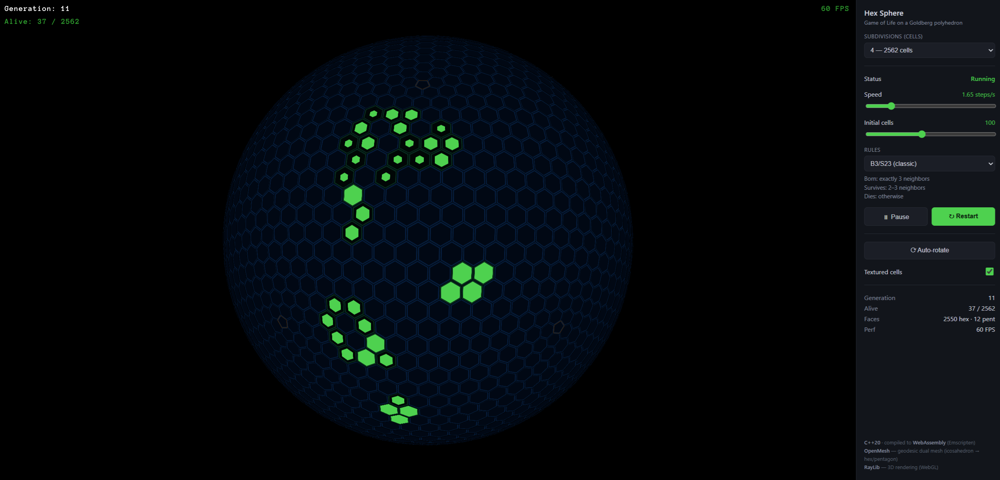

# Game of Life on a Hex Sphere

## Project Overview

The technical goal of this project was, in three steps:

1. **Build a sphere tiled with hexagons, starting from an icosahedron.** Using
   [OpenMesh](https://www.graphics.rwth-aachen.de/software/openmesh/) for the
   mesh work: an icosahedron is Loop-subdivided into a geodesic sphere, and its
   **dual mesh** is constructed to yield a Goldberg polyhedron — hexagons
   everywhere plus exactly 12 pentagons (a sphere cannot be tiled with hexagons
   alone).
2. **Render that geometry natively with [RayLib](https://www.raylib.com/)**,
   RayLib's OpenGL backend drawing the sphere, cell fills, and edges with an
   interactive 3D camera.
3. **Compile the same C++ source to WebAssembly** (via
   [Emscripten](https://emscripten.org/)) to produce a portable web application
   that runs in any modern browser with no install.

On top of that geometry runs a **Conway's Game of Life emulator on the
hexagonal sphere**, with a configurable number of cells (mesh resolution from
162 up to 10 242 faces), adjustable rules, speed, and initial population — the
automaton wraps seamlessly around the closed surface with no edges.

Playable GitLab Pages link:

- https://stepan-datsko-game-of-life-ai-native-challenge-ae11ae.pages.git.ringcentral.com/

GitLab project:

- https://git.ringcentral.com/rc-ai-learning/stepan-datsko-game-of-life-ai-native-challenge

## Game Description

Each face of the sphere (hexagon or pentagon) is one cell. Cells live and die by
Game-of-Life rules applied over **face adjacency** instead of a flat grid, so the
simulation is continuous across the whole closed surface. The 12 pentagons have
only 5 neighbors, so behavior near them differs subtly from the hexagonal
majority — an emergent quirk of playing Life on a sphere.

A side panel adjusts mesh resolution, simulation speed, initial population, and
the birth/survival rule set live, and switches between manual-orbit and
auto-rotate cameras.

### Controls

| Input        | Action                  |
|--------------|-------------------------|
| Left-drag    | rotate the sphere       |
| Mouse wheel  | zoom in / out           |
| Space        | pause / resume          |
| R            | restart with a new seed |
| Side panel   | rules, speed, size, camera |

## Screenshots



## Setup

No build and no install are required to **play** — the game is deployed as a
pre-built WebAssembly bundle.

- **Easiest:** open the GitLab Pages link above in any modern browser.
- **Locally:** the ready-to-serve bundle lives in [`dist/wasm/`](dist/wasm/)
  (`index.html`, `live.js`, `live.wasm`, `live.data`). Browsers refuse to
  `fetch` the `.data` file over `file://`, so serve it over HTTP:

  ```sh
  cd dist/wasm
  python3 -m http.server 8080
  ```

  Then open:

  ```text
  http://localhost:8080/
  ```

To build the game from source instead (native `.exe` or a fresh WASM bundle),
see [BUILD.md](BUILD.md).

## Deployment (GitLab Pages)

The [`.gitlab-ci.yml`](.gitlab-ci.yml) pipeline publishes the pre-built
`dist/wasm/` bundle and the Markdown docs into the `public/` artifact GitLab
Pages serves. After the default-branch pipeline succeeds, the game is playable
at the Pages link above.

## Documentation

- [SPEC.md](SPEC.md) — game rules, scope, requirements, acceptance criteria
- [ARCHITECTURE.md](ARCHITECTURE.md) — technology stack and design decisions
- [RETROSPECTIVE.md](RETROSPECTIVE.md) — how it was built with AI
- [BUILD.md](BUILD.md) — environment setup and building from source (native + WASM)
